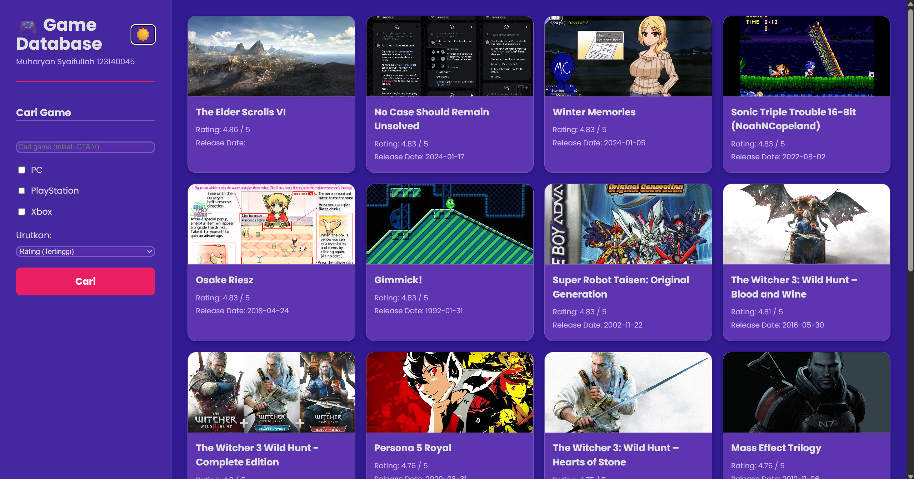

# UTS PemWeb - Game Database 🎮 (123140045)

**Studi Kasus:** Digit 5 - Game Database

## 🚀 Link Deployment Vercel

Aplikasi ini telah di-deploy ke Vercel dan dapat diakses secara publik melalui link berikut:

(https://uts-pemweb-123140045.vercel.app/)

---

##  Informasi Mahasiswa

* **Nama:** Muharyan Syaifullah
* **NIM:** 123140045

## 📝 Deskripsi Project

Aplikasi ini adalah *platform* database game yang memungkinkan pengguna untuk menjelajahi dan menemukan game baru. Aplikasi ini mengambil data secara *real-time* dari **RAWG Video Games API**.

Pengguna dapat melakukan pencarian berdasarkan nama, memfilter berdasarkan platform populer (PC, PlayStation, Xbox), dan mengurutkan hasil berdasarkan rating atau tanggal rilis. Aplikasi ini juga dilengkapi dengan *layout* *sidebar* yang modern, *card* game yang interaktif, dan modal untuk melihat detail game (termasuk screenshot).

## ✨ Fitur Utama

* **Pencarian Dinamis:** Mencari game berdasarkan nama.
* **Filter Platform:** Memfilter hasil berdasarkan platform (PC, PlayStation, Xbox).
* **Sorting:** Mengurutkan hasil berdasarkan Rating (Tertinggi) atau Tanggal Rilis (Terbaru).
* **Detail Game:** Menampilkan modal detail untuk setiap game, lengkap dengan deskripsi, genre, dan screenshot.
* **Toggle Tema (Light/Dark):** Fitur untuk beralih antara:
    * **Mode Gelap:** Tema "gaming" ungu/magenta.
    * **Mode Terang:** Tema "awan" biru/putih yang terinspirasi dari referensi desain.
* **Layout Responsif:** Tampilan sidebar di desktop dan beralih ke *layout* tumpuk di *mobile* (memenuhi kriteria Media Queries).

## 💻 Teknologi yang Digunakan

* **ReactJS** (dibuat dengan Vite)
* **CSS Murni** (termasuk CSS Grid, Flexbox, Media Queries, dan CSS Variables untuk *theming*)
* **JavaScript (ES6+)** (*Async/Await*, Hooks: `useState`, `useEffect`, `useCallback`)
* **RAWG Video Games API**
* **Vercel** (untuk Deployment)

## 🛠️ Cara Instalasi dan Menjalankan

1.  Clone repository ini:
    ```bash
    git clone [https://github.com/muharyansyaifullah/uts-pemweb-123140045.git](https://github.com/muharyansyaifullah/uts-pemweb-123140045.git)
    cd uts-pemweb-123140045
    ```

2.  Install semua dependencies:
    ```bash
    npm install
    ```

3.  Buat file `.env` di root project dan tambahkan API Key dari [RAWG.io](https://rawg.io/apidocs).
    ```
    VITE_RAWG_API_KEY=API_KEY_ANDA
    ```
    (API key yang digunakan saat pengembangan: `6877a68f0a3f454d85e2a000accfbaed`)

4.  Jalankan project di mode development:
    ```bash
    npm run dev
    ```

## 📸 Screenshot Aplikasi

### Mode Gelap (Tema "Gaming")


### Mode Terang (Tema "Awan")

